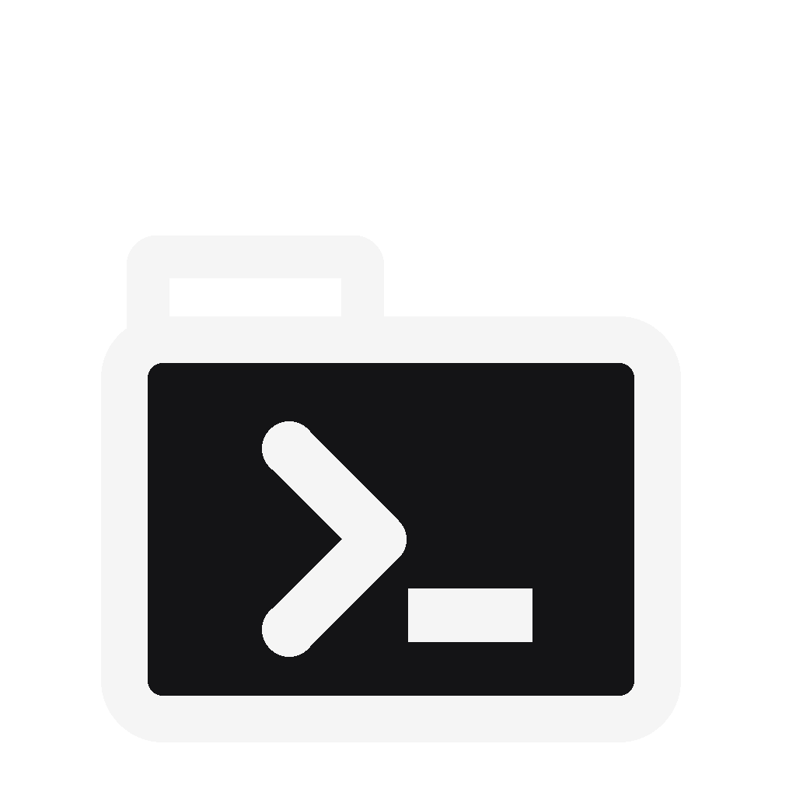

<p align="center">
  
</p>

<h1 align="center">Opencode Portable</h1>

<p align="center">Run <a href="https://github.com/anomalyco/opencode">opencode</a> as a truly portable app on <b>Windows 10 / 11</b>: double-click, pick a folder, work.<br>Close it — quit, X, Ctrl+C, even Task Manager kill — and <b>zero traces remain</b>.</p>

<p align="center">
  <a href="README.md"></a>
  <a href="README.it.md"></a>
</p>

<p align="center">
  <a href="LICENSE"></a>
  
  <a href="https://github.com/terzastella/opencode-portable/releases"></a>
  <a href="https://github.com/terzastella/opencode-portable/actions"></a>
</p>

> Designed for opencode's built-in free models — no login, no providers to
> connect. External providers (NVIDIA, Anthropic, OpenAI, …) were **not
> tested** with this project: API keys are accepted per session but provider
> setups are unverified.
>
> Tested with opencode `1.18.31` (snapshot version; setup scripts default to latest upstream).

## Download

No install, no setup: grab **`OpencodePortable.exe`** from the
[latest release](https://github.com/terzastella/opencode-portable/releases),
put it anywhere (Desktop, USB stick), double-click it. That's the whole
installation.

## Quickstart

1. **Double-click** `OpencodePortable.exe`.
2. **Pick the work folder** (explorer dialog, or drag-and-drop it into the console).
3. **Work.** On close, everything the app wrote — config, cache, state, tmp,
   binary — is deleted with the per-run folder. Nothing is ever written next
   to the exe.

## Why portable

| Concern | What you get |
|---|---|
| Isolation | Config, data, cache, state and temp live in `<workspace>/.opencode-portable-<timestamp>-<pid>-<rand>/`, deleted on exit — normal quit, X/Alt+F4, Ctrl+C and Task Manager kill included |
| Offline | Embedded opencode binary, extracted on first run — no network, ever |
| Fast startup | Skips the blocking 10–30 s `models.dev` fetch |
| No login stored | Built-in free models just work; provider API keys are typed per session, never stored |
| Concurrent runs | Each run gets its own folder — no sharing, no locks |

## Verify zero traces

After a run, check nothing was left behind:

```cmd
:: 1. workspace clean (shows hidden/system too):
dir "C:\path\to\workspace" /a
:: 2. known leftovers on C: (the exe itself is expected):
dir C:\*opencode* /s /b /a
dir C:\opwatch-*.exe /s /b /a
:: 3. no lingering processes (tasklist takes no wildcards):
tasklist | findstr /I "opencode opwatch"
```

Expected: only your files, only the exe, no processes.

<details>
<summary><b>Build from source</b></summary>

```bash
git clone https://github.com/terzastella/opencode-portable.git
cd opencode-portable
```

```powershell
# All-in-one exe (requires .NET 10 SDK) — resolves latest opencode,
# embeds + hashes it, publishes to dist/:
.\scripts\publish-fat.ps1
```

See [docs/HOW-IT-WORKS.md](docs/HOW-IT-WORKS.md) for the full architecture.

</details>

<details>
<summary><b>Option B — scripts (Windows .cmd/.ps1, Linux/macOS .sh)</b></summary>

Download the binary for your OS into `bin/` (binaries are **not** committed to git):

```powershell
# Windows
.\scripts\setup.ps1
# optionally: .\scripts\setup.ps1 -Version 1.18.31
```

```bash
# Linux / macOS
./scripts/setup.sh
# optionally: ./scripts/setup.sh --version 1.18.31
```

Run it:

```cmd
:: Windows (double-click works too)
opencode-portable.cmd --help
```

```powershell
# Windows PowerShell (pipeline-capable)
.\opencode-portable.ps1 --help
```

```bash
# Linux / macOS
./opencode-portable.sh --help
```

On first run `config/opencode.json` is auto-created from `config/opencode.example.json`.
(`--help` is opencode's own flag: it needs the downloaded binary, otherwise launchers fail closed.)

</details>

<details>
<summary><b>Project structure</b></summary>

```
.
├── dist/OpencodePortable.exe  # single-file Windows app (build: scripts/publish-fat.ps1)
├── opencode-portable.cmd   # Windows launcher (double-click friendly)
├── opencode-portable.ps1   # Windows PowerShell launcher (mirror)
├── opencode-portable.sh    # Linux / macOS launcher (mirror)
├── bin/                    # binaries go here (git-ignored, see scripts/setup.*)
├── assets/                 # logo.svg, logo.png, opencode-portable.ico
├── config/
│   ├── opencode.example.json  # tracked template
│   └── opencode.json          # your local config (git-ignored, auto-created)
├── data/                   # all runtime files (git-ignored)
│   ├── config/ data/ cache/ state/ tmp/
├── scripts/
│   ├── setup.ps1           # download windows-x64/arm64 binary
│   ├── setup.sh            # download linux/darwin x64/arm64 binary
│   ├── publish-fat.ps1     # build the all-in-one exe (embeds upstream zip)
│   ├── pack-release.ps1/.sh  # clean release archives with secret scan
│   └── install-shortcuts.ps1  # Desktop + Start Menu shortcuts with icon
├── src/OpencodePortable/   # C# source of the single-file exe
├── docs/HOW-IT-WORKS.md    # architecture details
├── LICENSE                 # MIT
├── README.md               # this file (EN)
└── README.it.md            # Italian version
```

(`bin/` holds `opencode.exe` + `.gitkeep`; `config/` holds the tracked
`opencode.example.json`; `dist/`, `data/`, `src/**/payload|bin|obj` are
git-ignored build/runtime outputs.)

Desktop shortcuts (Windows):

```powershell
.\scripts\install-shortcuts.ps1            # create Desktop + Start Menu shortcuts
.\scripts\install-shortcuts.ps1 -Uninstall # remove them
```

Shortcuts launch `opencode-portable.cmd` with the custom icon from `assets/opencode-portable.ico`. (Deliberately the script, not the exe: shortcuts are for quick terminal use; the exe is the double-click app.) Working directory is the portable root.

</details>

<details>
<summary><b>How it works</b></summary>

| Concern | What the launchers do |
|---|---|
| Isolation | Set `XDG_CONFIG_HOME`, `XDG_DATA_HOME`, `XDG_CACHE_HOME`, `XDG_STATE_HOME` to `data/...`, and `OPENCODE_CONFIG` to `config/opencode.json` |
| Fast startup | Set `OPENCODE_DISABLE_MODELS_FETCH=1` (skips the blocking 10–30 s `models.dev` fetch) |
| Temp | Isolated per-run tmp (`TMP/TEMP/TMPDIR` point inside it, deleted on exit). Naming differs per launcher: `run-HHMMSS-RAND` (cmd), `run-yyyyMMdd-HHmmss-PID-rand` (ps1), `mktemp run-...-PID-XXX` (sh); the exe needs no sub-level (its root is already per-run) |
| Crash leftovers | Swept next run (exe + ps1/sh: dead PID only, live never touched; cmd: age >7 days, no PID check — documented divergence) |
| Host pollution guard | Snapshot `%TEMP%\opencode`, `%LOCALAPPDATA%\opencode`, `%APPDATA%\opencode` (Win) or `~/.config/opencode`, `~/.local/share/opencode`, `~/.cache/opencode` (Unix) and remove them on exit **only if this run created them** |
| Env hygiene | `.ps1`/`.sh` restore or scope env vars (`try/finally`, `trap`); concurrent instances are safe |

The exe adds: supervised child folder picker (native crash degrades to
drag-and-drop fallback), deletion retried against locked files (leftovers
reported, never silent), `--clean <workspace>` sweeper, and an orphan watchdog
(`opwatch-<pid>-<rand>.exe`, self-deleting) covering even Task Manager group
kills. Watchdog telemetry lives in `%TEMP%` (removed on success).

See [docs/HOW-IT-WORKS.md](docs/HOW-IT-WORKS.md) for details.

</details>

<details>
<summary><b>Binaries policy</b></summary>

`bin/`, `data/`, `dist/`, `src/**/payload|bin|obj` and local `config/opencode.json` are git-ignored. The repo ships **source only**:

- `scripts/setup.ps1` → `opencode-windows-x64.zip` (or `-arm64`, auto-detected, WOW64-aware) from upstream releases
- `scripts/setup.sh` → `opencode-linux-x64.tar.gz` / `opencode-darwin-arm64.zip`, etc. (fails fast on unsupported OS/arch)
- If `bin/` is empty the launchers **refuse to run** (fail-closed): reusing `opencode` from `PATH` requires explicit opt-in (`--from-path` — stripped anywhere by exe/cmd, first-arg-only by ps1/sh — or `OPENCODE_ALLOW_PATH_FALLBACK=1`), and the resolved path is always printed. The exe prefers a bundled binary and only then looks at PATH.

For distribution: `pack-release.ps1` builds `opencode-portable-win-x64.zip`, `pack-release.sh` builds `opencode-portable-linux-macos.tar.gz`. Both secret-scan the content and never include `data/`, `bin/*`, `dist/` or local configs. The all-in-one exe itself (`dist/`) is never committed (~137 MB).

</details>

<details>
<summary><b>Security notes</b></summary>

- **Binaries are trusted upstream artifacts**: `setup.*` downloads and `publish-fat.ps1` embeds over HTTPS from GitHub releases, with no checksum pinning. If upstream ever publishes hashes/signatures, verify them before running.
- **Credentials live in `data/` (scripts) or `<workspace>/.opencode-portable-*/` (exe)** (auth tokens, API keys): never share or publish those folders, and never ship an archive containing them — `pack-release` excludes them by design. A lost USB stick means lost credentials.
- **Downloaded zips carry Mark-of-the-Web**: on other PCs Windows may block the `.ps1` launchers (execution policy). Use `opencode-portable.cmd`, or `Unblock-File`, after inspecting the content.
- This wrapper isolates files, it does **not sandbox** opencode itself: an AI coding agent runs shell commands in your workspace — review what it does, as with any upstream install.
- **Trust model**: the workspace is NOT a security boundary — use only folders you trust (no network shares, synced folders writable by others, or untrusted repos); anyone who can write the workspace can influence config, cache and extracted binaries. Same for `--from-path` / `OPENCODE_ALLOW_PATH_FALLBACK=1`: it bypasses the bundled-payload trust and runs whatever `opencode` is first in PATH — resolved path is always printed, hash it yourself if unsure.
- **Updates**: no auto-update (`autoupdate: false`); each release pins its opencode version in `UPSTREAM_VERSION` at build time (`publish-fat` uses the file unless `-Version` overrides it, then embeds + hashes it). To update, bump the file and download the new release.
- **CI**: every push/PR builds on Windows and runs the self-test suite (status badge below).
- **No Windows Error Reporting**: the exe silences WER for its own crashes (including supervised picker-child AVs) so nothing lands in `ReportArchive`; diagnostics stay in our own `crash-*.log`. `--clean-host` removes our host-side traces (old WER archives, watchdog telemetry leftovers, TEMP crash dir) — pre-existing archives may need admin.

</details>

<details>
<summary><b>Exe flags & exit codes</b></summary>

| Flag | Effect |
|---|---|
| `--workspace <dir>` / `--workspace=<dir>` | Skip the picker, start directly there |
| `--console` | Skip the dialog, go straight to drag-and-drop input |
| `--from-path` | Opt in to reusing `opencode` from PATH if no binary found (anywhere pre-`--`; also `OPENCODE_ALLOW_PATH_FALLBACK=1`) |
| `--picker-exe <path>` / `--picker-exe=<path>` | Use another executable as the picker child (diagnostics) |
| `--pick-folder [title] [initial]` | Child mode: native dialog, stdout protocol `PICK-OK` (0) / `PICK-CANCEL` (1) / `PICK-ERROR` (2) |
| `--watch <pid> <ticks> <dir>` | Watchdog mode (spawned automatically, orphan hop) |
| `--clean <dir>` | Sweep stale roots without launching; errors on missing dir |
| `--clean-host` | Remove own host traces (WER archives, watchdog telemetry, TEMP crash dir); always exit 0 |
| `--self-test` | Non-UI COM smoke test (instantiate + options + WER-silenced check, no dialog shown) |
| `--test-fallback`, `--test-close`, `--test-robust-delete`, `--test-watchdog`, `--test-watchdog-proc`, `--test-watchdog-copy`, `--test-detached` | Built-in self-tests (see source) |
| `--report-console <file>` | Write this process' console HWND (detachment probe) |
| `--has-payload` | Report embedded payload info; exit 0 iff present (used by publish-fat) |
| `--` | Everything after is forwarded to opencode verbatim, even launcher-like flags |

Exit codes: `0` = ok / picker cancelled / `--clean-host` done; `1` = invalid workspace, missing binary/config, failed fallback, failed self-test, `--clean` missing dir, `--watch` misuse, watchdog abort, fatal error (MessageBox + `crash-*.log` with line numbers); `2` = picker-child internal error (parent maps it to fallback); otherwise opencode's own exit code is propagated.

</details>

<details>
<summary><b>Config</b></summary>

Scripts flow: edit `config/opencode.json` (defaults: `autoupdate: false`, `share: "disabled"` — sensible for a portable install). The template lives in `config/opencode.example.json`; delete your local `opencode.json` to reset to defaults.

Exe flow: the config is **ephemeral per run** (`<root>/config/opencode.json`, from the template next to the exe or the embedded default) and deleted on exit with everything else.

Note: this project targets opencode's built-in free models only — no login, no
external providers to connect. Login/auth state never persists for the exe
(fresh root every run); provider API keys, if you ever need other models, are
typed per session, never stored (see [HOW-IT-WORKS](docs/HOW-IT-WORKS.md) § Auth note).

</details>

## Docs

Full architecture: [docs/HOW-IT-WORKS.md](docs/HOW-IT-WORKS.md) (English).

## License

[MIT](LICENSE) — © 2026 Terzastella.
